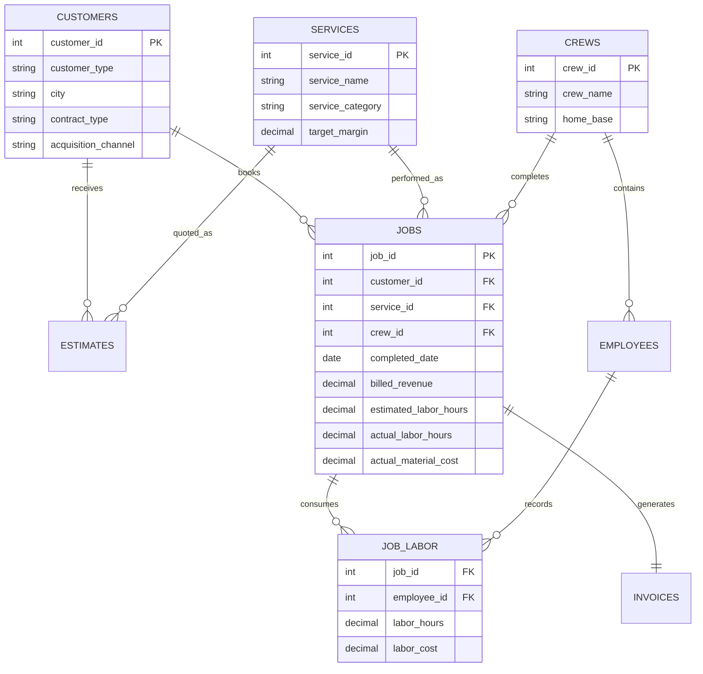

# Data Model

```mermaid
erDiagram
    CUSTOMERS ||--o{ ESTIMATES : receives
    CUSTOMERS ||--o{ JOBS : books
    SERVICES ||--o{ ESTIMATES : quoted_as
    SERVICES ||--o{ JOBS : performed_as
    CREWS ||--o{ JOBS : completes
    CREWS ||--o{ EMPLOYEES : contains
    JOBS ||--o{ JOB_LABOR : consumes
    EMPLOYEES ||--o{ JOB_LABOR : records
    JOBS ||--|| INVOICES : generates

    CUSTOMERS {
      int customer_id PK
      string customer_type
      string city
      string contract_type
      string acquisition_channel
    }
    JOBS {
      int job_id PK
      int customer_id FK
      int service_id FK
      int crew_id FK
      date completed_date
      decimal billed_revenue
      decimal estimated_labor_hours
      decimal actual_labor_hours
      decimal actual_material_cost
    }
    JOB_LABOR {
      int job_id FK
      int employee_id FK
      decimal labor_hours
      decimal labor_cost
    }
    SERVICES {
      int service_id PK
      string service_name
      string service_category
      decimal target_margin
    }
    CREWS {
      int crew_id PK
      string crew_name
      string home_base
    }
```

`fct_job_profitability` is the primary analytical fact table. It enriches each completed job with customer, service, crew, labor-cost, and profitability attributes.
